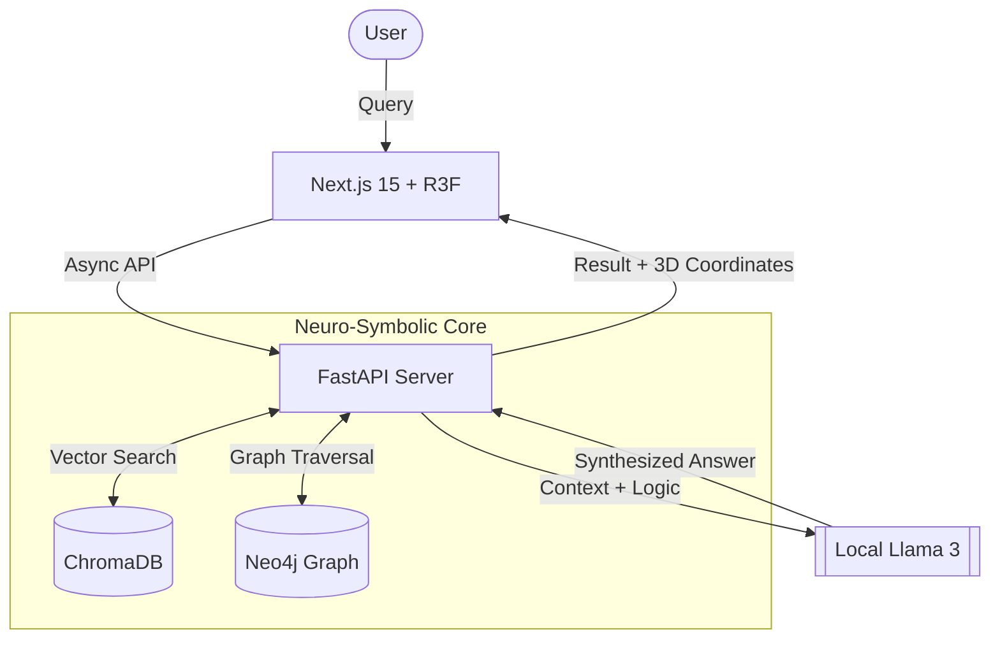

# AURELIUS
## A Neuro-Symbolic Logic Engine for Verifiable Inference

---

## Abstract
Aurelius is a distributed reasoning engine designed to mitigate the "Hallucination Problem" in Large Language Models (LLMs). By grounding neural generations in a deterministic Knowledge Graph (KG), Aurelius ensures that every answer is mathematically traceable to a source document. 

Unlike standard RAG (Retrieval-Augmented Generation) which retrieves unstructured text chunks, Aurelius retrieves Logic Paths (e.g., `(Subject)-[PREDICATE]->(Object)`), allowing for multi-hop reasoning across disparate data sources.

---

## System Architecture



The system operates on a Two-Brain architecture:

1.  **The Neural Brain (Right Hemisphere) - Llama 3 / ChromaDB**
    *   Handles unstructured semantics, nuance, and natural language generation.
    *   *Role:* Translator & Summarizer.
2.  **The Symbolic Brain (Left Hemisphere) - Neo4j / NetworkX**
    *   Handles rigid facts, logic constraints, and topological relationships.
    *   *Role:* Verifier & Logician.

### Technical Stack
*   **Inference:** Ollama (Llama 3.1 8B / GGUF Quantized)
*   **Graph Store:** Neo4j (Cypher Query Language)
*   **Vector Store:** ChromaDB (Semantic Embeddings)
*   **Backend:** Python 3.12 + FastAPI (Async Event Loop)
*   **Frontend:** Next.js 15 (React Three Fiber / WebGL Visualization)

---

## Key Capabilities

### 1. The "Golden Beam" Visualization
User logic queries are visualized in a high-performance 3D Knowledge Space.
*   **Confidence Scoring:** Edge thickness represents probabilistic confidence.
*   **Force-Directed Layout:** Nodes auto-organize based on semantic clustering.

### 2. Semantic Triplet Extraction
The engine automatically ingests PDF research papers and converts them into structured logic:
> *Attention mechanisms improved translation quality.*
> $\rightarrow$ `(Attention Mechanisms)-[IMPROVED]->(Translation Quality)`

### 3. "Confidence-Aware" Traversal
The pathfinding algorithm (modified Dijkstra) penalizes paths that rely on weak inferences, ensuring the final answer prioritizes high-certainty facts.

---

## Deployment Instructions

### Prerequisites
*   Docker & Docker Compose
*   Node.js 20+
*   Python 3.12+
*   Ollama (running `llama3`)

### 1. Start the Infrastructure
```bash
docker-compose up -d
# Starts Neo4j (Graph) and ChromaDB (Vector)
```

### 2. Start the Engine (Backend)
```bash
cd server
python -m venv venv
# source venv/bin/activate or .\venv\Scripts\activate
pip install -r requirements.txt
python -m uvicorn app.main:app --reload --port 8000
```

### 3. Start the Aurelius (Frontend)
```bash
cd client
npm install
npm run dev
# Open http://localhost:3000
```

---

## Future Research Directions
*   **Temporal Graphs:** Introducing `t` (time) to triplets to track conflicting facts over history.
*   **Recursive Self-Correction:** Allowing the LLM to query the graph, realize it is missing information, and request a new search query autonomously.

---


