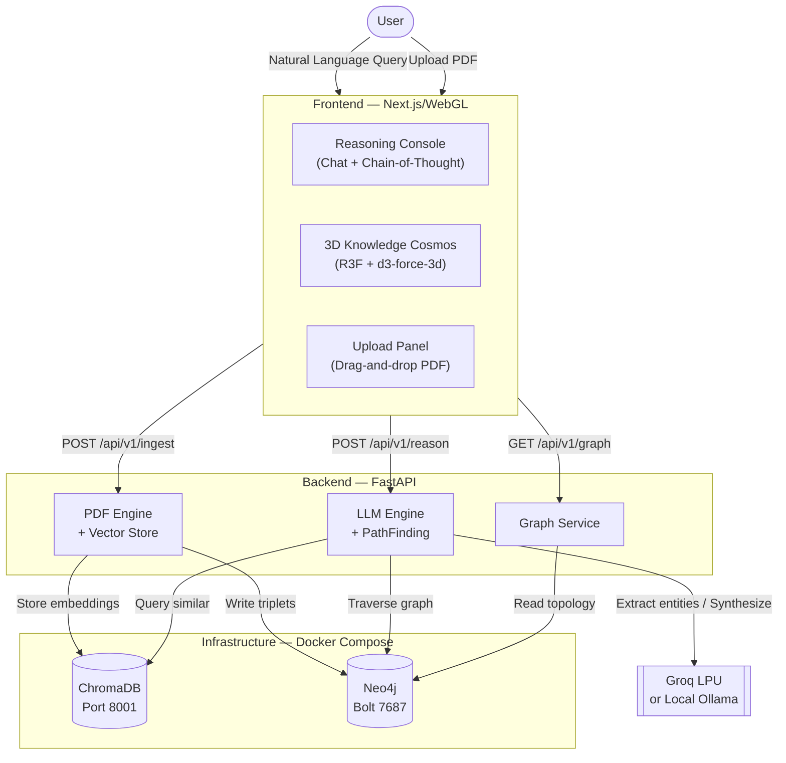

<div align="center">

# AURELIUS

### A Neuro-Symbolic Reasoning Engine for Verifiable AI Inference

 *"Standard LLMs generate. Aurelius verifies."* 

</div>

---

## Abstract

The **Hallucination Problem** in Large Language Models (LLMs) stems from a fundamental architectural flaw: neural networks generate probabilistically plausible text with no mechanism for ground-truth verification. Retrieval-Augmented Generation (RAG) mitigates this by appending unstructured text chunks to the context window — but this approach inherits the same problem. The model still *guesses*.

**Aurelius** proposes a different paradigm: **Neuro-Symbolic Graph RAG**.

Instead of retrieving unstructured text, Aurelius constructs a deterministic **Knowledge Graph** from source documents by extracting structured semantic triplets — `(Subject)-[PREDICATE]→(Object)` — via LLM-guided extraction. At query time, rather than pattern-matching over probabilistic embeddings, Aurelius executes a **confidence-weighted graph traversal** (Dijkstra-variant) across the symbolic topology, producing an answer that is mathematically traceable to a specific node in the knowledge graph.

Every answer comes with:
- A **verified reasoning path** through the graph
- A **confidence score** derived from edge weight products
- **Exact source attribution** to the ingested document

This is not retrieval. This is **logical inference**.

---

## System Architecture


```mermaid
graph TD
    User([User]) -->|Natural Language Query| FE
    User -->|Upload PDF| FE

    subgraph FE [Frontend — Next.js/WebGL]
        Console["Reasoning Console<br>(Chat + Chain-of-Thought)"] 
        Canvas["3D Knowledge Cosmos<br>(R3F + d3-force-3d)"]
        Upload["Upload Panel<br>(Drag-and-drop PDF)"]
    end

    FE -->|POST /api/v1/ingest| Ingest
    FE -->|POST /api/v1/reason| Reason
    FE -->|GET /api/v1/graph| Graph

    subgraph BE [Backend — FastAPI]
        Ingest["PDF Engine<br>+ Vector Store"]
        Reason["LLM Engine<br>+ PathFinding"]
        Graph["Graph Service"]
    end

    Ingest -->|Store embeddings| Chroma[(ChromaDB<br>Port 8001)]
    Ingest -->|Write triplets| Neo4j[(Neo4j<br>Bolt 7687)]
    Reason -->|Query similar| Chroma
    Reason -->|Traverse graph| Neo4j
    Reason -->|Extract entities / Synthesize| LLM[["Groq LPU<br>or Local Ollama"]]
    Graph -->|Read topology| Neo4j

    subgraph Infra [Infrastructure — Docker Compose]
        Chroma
        Neo4j
    end
```

### The Two-Brain Architecture

Aurelius is modeled on the dual-process theory of cognition:

| Brain | Technology | Function |
|-------|-----------|----------|
| **Neural (Right Hemisphere)** | Llama 3.1 8B via Groq LPU / Local Ollama | Semantics, NLU, triplet extraction, answer synthesis |
| **Symbolic (Left Hemisphere)** | Neo4j 5.15 + Cypher + confidence weights | Logic, verification, constraint satisfaction, pathfinding |

The system's core insight: **use neural intelligence to build the symbolic graph, then use symbolic reasoning to answer questions deterministically**. The LLM is a translator, not the authority.

---

## The Reasoning Pipeline

A single query traverses four deterministic stages:

**Example query:** `"What did attention mechanisms improve?"`

**Stage 1 — Entity Extraction (Neural)**

Groq Llama 3 extracts named entities from the natural language query.
```
Output: ["Attention Mechanisms", "Translation Quality"]
```

**Stage 2 — Vector Search (Neural Retrieval)**

ChromaDB retrieves the 5 most semantically similar text chunks from ingested documents.

**Stage 3 — Graph Traversal (Symbolic Reasoning)**

Confidence-weighted pathfinding selects the most reliable reasoning chain:
```
(Attention Mechanisms) -[IMPROVED {confidence: 1.0}]-> (Translation Quality)
                       -[MEASURED_BY {confidence: 0.95}]-> (BLEU Score)

Path Confidence = 1.0 x 0.95 = 0.95  -->  Golden Beam activated
```

**Stage 4 — Grounded Synthesis (Neural Output)**

Llama 3 synthesizes an answer grounded exclusively in the verified path and retrieved chunks:
```
"The graph shows: Attention Mechanisms -> IMPROVED -> Translation Quality.
 Based on Vaswani et al. (2017), this was measured via a 2 BLEU score
 improvement, replacing recurrent architectures with self-attention."
```

---

## Key Technical Contributions

### 1. Confidence-Weighted Pathfinding (True Dijkstra)

Unlike standard `shortestPath()` which minimizes hop count, Aurelius selects the path with **maximum confidence product** — the reasoning chain where every edge has been verified:

```cypher
MATCH (start:Entity), (end:Entity)
WHERE toLower(start.name) CONTAINS toLower($start)
MATCH p = (start)-[*1..8]-(end)
WITH p, [r IN relationships(p) | coalesce(r.confidence, 1.0)] AS confidences
WITH p, reduce(acc = 1.0, c IN confidences | acc * c) AS path_confidence
ORDER BY path_confidence DESC
LIMIT 1
RETURN [n IN nodes(p) | n.name] AS node_names, path_confidence
```

This is equivalent to running Dijkstra on `(1 - confidence)` edge weights — maximizing certainty at every hop.

### 2. LLM-Forced Triplet Extraction

The extraction prompt enforces strict JSON output with zero hallucination tolerance:

```python
# From server/app/services/llm_engine.py
system = "You are a Knowledge Graph extraction engine. Output valid JSON only."

prompt = """Extract exact facts as semantic triplets.
RULES:
1. OUTPUT: [{"subject": "...", "predicate": "VERB", "object": "..."}]
2. Predicates are UPPERCASE verbs (IMPROVED, CAUSED, DISCOVERED)
3. Do NOT hallucinate — only extract explicitly stated facts
4. Empty text → return []
"""
# temperature=0 + response_format={"type": "json_object"} = deterministic output
```

### 3. Idempotent Graph Population with MERGE

Every knowledge injection is safe to re-run — no duplicate nodes ever created:

```cypher
MERGE (s:Entity {name: $subj})
MERGE (o:Entity {name: $obj})
MERGE (s)-[r:PREDICATE]->(o)
ON CREATE SET r.confidence = 1.0, r.created_at = timestamp()
```

### 4. Dual-Provider LLM with Graceful Degradation

The inference backend automatically selects the fastest available provider:

```python
async def _call_llm(prompt: str, system: str, json_mode: bool = True) -> str:
    if LLMEngine.GROQ_API_KEY:
        return await LLMEngine._call_groq(prompt, system, json_mode)   # Cloud LPU (~300 tok/s)
    else:
        return await LLMEngine._call_ollama(prompt, system, json_mode)  # Local Llama 3
```

### 5. d3-force-3d Physics Layout

The 3D knowledge graph uses a physics simulation to organize nodes into semantic clusters — connected concepts naturally orbit each other:

```typescript
const simulation = forceSimulation(simNodes)
    .numDimensions(3)
    .force("link", forceLink(simLinks).id(d => d.id).distance(10).strength(0.6))
    .force("charge", forceManyBody().strength(-70))
    .force("center", forceCenter(0, 0, 0));

simulation.tick(400); // Converge to stable layout synchronously
```

---

## Technical Stack

| Layer | Technology | Version | Purpose |
|-------|-----------|---------|---------|
| **Inference** | Groq Cloud (LPU) / Ollama | — / 0.3+ | Ultra-fast / local Llama 3.1 8B |
| **Graph Store** | Neo4j | 5.15 | Symbolic knowledge topology |
| **Vector Store** | ChromaDB | 0.5+ | Semantic embedding retrieval |
| **Embeddings** | `all-MiniLM-L6-v2` | — | Local sentence embeddings (no API) |
| **Backend** | FastAPI + Uvicorn | 0.115+ | Async Python REST engine |
| **Rate Limiting** | slowapi | 0.1.9 | Protect ingest endpoint |
| **HTTP Client** | httpx | 0.28 | Async Ollama calls (non-blocking) |
| **Frontend** | Next.js 16 + TypeScript | 16.1 | App Router with React 19 |
| **3D Engine** | React Three Fiber | 9.5 | WebGL knowledge graph |
| **Post-Processing** | `@react-three/postprocessing` | 3.0 | Bloom + Vignette effects |
| **Physics Layout** | d3-force-3d | 3.0 | Force-directed 3D positioning |
| **State** | Zustand | 5.0 | Minimal global state management |
| **Animations** | Framer Motion | 12 | Scroll-linked landing animations |
| **Infrastructure** | Docker Compose | — | Neo4j + ChromaDB orchestration |

---

## Project Structure

```
aurelius/
├── server/                             # FastAPI Backend (Python 3.12)
│   ├── app/
│   │   ├── main.py                     # App factory, CORS, health check, rate limiting
│   │   ├── api/
│   │   │   ├── ingest.py               # POST /api/v1/ingest  — PDF ingestion pipeline
│   │   │   ├── reason.py               # POST /api/v1/reason  — Core reasoning loop *
│   │   │   └── graph.py                # GET  /api/v1/graph   — Graph data for 3D viz
│   │   ├── services/
│   │   │   ├── llm_engine.py           # Async LLM wrapper (Groq + Ollama)          *
│   │   │   ├── graph_service.py        # Neo4j CRUD + fuzzy entity search            *
│   │   │   ├── path_service.py         # Confidence-weighted Dijkstra pathfinder     *
│   │   │   ├── vector_service.py       # ChromaDB embedding store
│   │   │   └── pdf_engine.py           # PDF extraction + sliding window chunking
│   │   └── db/
│   │       ├── neo4j_client.py         # Singleton Neo4j driver
│   │       └── chroma_client.py        # Singleton ChromaDB client
│   ├── requirements.txt
│   └── .env.example
│
├── client/                             # Next.js 16 Frontend (TypeScript)
│   ├── src/
│   │   ├── app/
│   │   │   ├── page.tsx                # Landing page (Framer Motion + Bento grid)
│   │   │   └── engine/page.tsx         # Engine page (3D + Console + Upload + HUD)
│   │   ├── components/
│   │   │   ├── cosmos/SceneGraph.tsx   # 3D graph — d3-force-3d, edges, Golden Beam  *
│   │   │   ├── console/ReasoningConsole.tsx  # Chat + Chain-of-Thought + Explainability *
│   │   │   ├── upload/UploadPanel.tsx  # Drag-and-drop PDF injection UI
│   │   │   └── nav/NavBar.tsx          # Live health status navigation bar
│   │   └── store/useGraphStore.ts      # Zustand store (graph + path + health state)
│   └── .env.local
│
├── docker-compose.yml                  # Neo4j 5.15 + ChromaDB orchestration
└── README.md
```

> Files marked `*` are the core algorithmic contributions.

---

## Getting Started

### Prerequisites

| Requirement | Version | Notes |
|-------------|---------|-------|
| Docker Desktop | Latest | For Neo4j + ChromaDB |
| Node.js | 20+ | For Next.js frontend |
| Python | 3.12+ | For FastAPI backend |
| Groq API Key | — | Free at [console.groq.com](https://console.groq.com) — **or** use Ollama locally |

### Step 1 — Clone and Configure

```bash
git clone https://github.com/YOUR_USERNAME/aurelius.git
cd aurelius
```

**Backend environment** — copy the example and fill in your values:
```bash
cp server/.env.example server/.env
```

```env
# server/.env — minimum required configuration

NEO4J_URI=bolt://localhost:7687
NEO4J_USER=neo4j
NEO4J_PASSWORD=password

CHROMA_HOST=localhost
CHROMA_PORT=8001

# Option A: Groq Cloud (recommended — ultra-fast, free tier)
GROQ_API_KEY=gsk_your_key_here

# Option B: Local Ollama (no API key needed)
# Ensure Ollama is running: ollama run llama3
# OLLAMA_URL=http://localhost:11434/api/generate
# LLM_MODEL=llama3
```

### Step 2 — Start Infrastructure

```bash
docker-compose up -d
```

This starts:
- **Neo4j 5.15** → `http://localhost:7474` (Browser UI) + `bolt://localhost:7687`
- **ChromaDB** → `http://localhost:8001`

Both services use persistent Docker volumes so your knowledge graph survives restarts.

### Step 3 — Start the Engine (Backend)

```bash
cd server
python -m venv venv
source venv/bin/activate        # Linux/Mac
# or: .\venv\Scripts\activate   # Windows

pip install -r requirements.txt
python -m uvicorn app.main:app --reload --port 8000
```

Verify the engine is online:
```bash
curl http://localhost:8000/health
# → {"status": "healthy", "services": {"neo4j": "connected", "chromadb": "connected", "llm": "groq:configured"}}
```

### Step 4 — Start the Frontend

```bash
cd client
npm install
npm run dev
# → Open http://localhost:3000
```

### Step 5 — Run Your First Reasoning Query

1. Navigate to `http://localhost:3000/engine`
2. Click **INJECT KNOWLEDGE** (top right) and drop a research PDF
3. Watch the 3D knowledge graph populate with extracted concepts
4. Type a question in the console, e.g.: *"What did attention mechanisms improve?"*
5. Observe:
   - The **chain-of-thought reasoning trace** feeding step by step
   - The **Golden Beam** highlighting the verified logic path in the 3D cosmos
   - The **Explainability Panel** showing entities found, path traversal, and confidence score
   - The **grounded answer** citing the specific reasoning chain

---

## API Reference

### `POST /api/v1/ingest`

Ingests a PDF into the neuro-symbolic memory. Rate limited to **5 requests/minute**.

```bash
curl -X POST http://localhost:8000/api/v1/ingest \
  -F "file=@attention_is_all_you_need.pdf"
```

```json
{
  "status": "success",
  "filename": "attention_is_all_you_need.pdf",
  "chunks_processed": 42,
  "triplets_extracted": 187,
  "message": "Knowledge graph enriched with 187 verified facts."
}
```

---

### `POST /api/v1/reason`

Executes the full neuro-symbolic reasoning loop on a natural language query.

```bash
curl -X POST http://localhost:8000/api/v1/reason \
  -H "Content-Type: application/json" \
  -d '{"query": "What did attention mechanisms improve?"}'
```

```json
{
  "answer": "The graph shows: Attention Mechanisms → IMPROVED → Translation Quality. Based on the knowledge graph path derived from Vaswani et al. (2017), attention mechanisms improved translation quality as measured by BLEU score, replacing recurrent architectures with a parallelizable self-attention mechanism.",
  "path": {
    "nodes": ["Attention Mechanisms", "Translation Quality", "BLEU Score"],
    "confidence": 0.92,
    "type": "Golden Beam",
    "path_length": 2
  },
  "entities_found": ["Attention Mechanisms", "Translation Quality"],
  "vector_chunks_used": 5,
  "steps": [
    "Parsing query intent and extracting named entities...",
    "Entities identified: Attention Mechanisms, Translation Quality",
    "Retrieving semantic context from vector memory (ChromaDB)...",
    "Traversing Knowledge Graph for entities: [Attention Mechanisms, Translation Quality]...",
    "Reasoning path identified (Golden Beam). Confidence: 92%",
    "Synthesizing grounded answer from verified logic chain...",
    "Verification complete. Answer grounded in knowledge graph."
  ]
}
```

---

### `GET /api/v1/graph`

Returns the complete node/edge topology for 3D visualization (limit 1000 nodes).

```bash
curl http://localhost:8000/api/v1/graph
```

```json
{
  "nodes": [{"id": "Attention Mechanisms"}, {"id": "Transformer"}, ...],
  "links": [{"source": "Attention Mechanisms", "target": "Transformer", "type": "PART_OF"}, ...]
}
```

---

### `GET /health`

Comprehensive health check - verifies all dependent services simultaneously.

```json
{
  "status": "healthy",
  "version": "1.0.0",
  "services": {
    "neo4j": "connected",
    "chromadb": "connected",
    "llm": "groq:configured"
  }
}
```

---

## Design System

Aurelius uses a cohesive visual language built for scientific credibility and premium aesthetics:

| Token | Value | Usage |
|-------|-------|-------|
| `--void-black` | `#050505` | Background |
| `--cyber-gold` | `#fbbf24` | High-confidence reasoning paths |
| `--holographic-blue` | `#818cf8` | Secondary graph nodes |
| `--symbolic-green` | `#6ee7b7` | Confirmed/verified states |
| `--font-display` | Space Grotesk | Headings, labels |
| `--font-body` | Inter | Body text |
| `--font-mono` | System monospace | Console, code, metrics |

**3D Post-Processing Stack:**
- Bloom (luminanceThreshold: 1, intensity: 1.5) - emissive node glow
- Vignette (darkness: 1.1) - cinematic depth
- Stars (count: 5000) - cognitive "universe" metaphor

---

## Infrastructure Notes

### Docker Networking

Both databases run on the `aurelius_net` bridge network. **Port mapping to note:**

```yaml
chromadb:
  ports:
    - "8001:8000"   # Host 8001 → Container 8000
```

The FastAPI backend connects via `localhost:8001` when running locally (not containerized). This is reflected in `CHROMA_PORT=8001` in `.env`.

### Data Persistence

Graph and vector data survive container restarts via volume mounts:
```
./infrastructure/neo4j/data  → /data  (Neo4j nodes/edges)
./infrastructure/chroma/      → /chroma/chroma  (ChromaDB embeddings)
```

### Security

- CORS is locked to `http://localhost:3000` (not wildcard)
- Cypher injection prevented by regex sanitization of all predicate names: `[^A-Z0-9_]` stripped
- `/ingest` rate-limited via `slowapi` (5 req/min per IP)
- Temporary PDF files use `tempfile.NamedTemporaryFile` with guaranteed cleanup

---

## Comparison: Standard RAG vs. Aurelius

| Dimension | Standard LLM / RAG | Aurelius Engine |
|-----------|-------------------|-----------------|
| **Trust Model** | "Trust me bro" (probabilistic) | Confidence-weighted graph proof |
| **Traceability** | Vague citations | Exact Graph Node IDs + path |
| **Reasoning Type** | Pattern matching | Symbolic graph traversal |
| **Complex Queries** | Fails at multi-hop logic | Infinite-depth pathfinding |
| **Hallucination Rate** | Baseline neural approximation | Constrained to verified graph edges |
| **Answer Format** | Free-form generation | Path-cited synthesis |
| **Confidence Score** | None | Derived from edge weight products |
| **Visual Explainability** | None | 3D force-directed topology |

---

## Research Context & Future Directions

### Motivated By

This project was built during exploratory research into the intersection of **neuro-symbolic AI** and **knowledge representation**. The primary failure mode addressed is the inability of pure LLM systems to distinguish between "what sounds true" and "what is provably true."

The medical and scientific domains - where Aurelius was primarily tested — have zero tolerance for hallucination. A fact-tracing graph system where every claim has a provenance trail is not merely useful, it is necessary.

### Future Research

- **Temporal Triplets** - Extend the data model with a `timestamp` property on relationships, enabling queries like *"What did X claim in 2020 vs. 2024?"* and tracking knowledge drift
- **Recursive Self-Querying** - Allow the reasoning engine to detect gaps in the graph mid-traversal and autonomously generate a new search query to fill them before answering
- **Probabilistic Edge Inference** - Use Bayesian network methods to infer new edges from existing ones at sub-threshold confidence, expanding the symbolic graph beyond what was explicitly extracted
- **Multi-Document Entity Resolution** - Improved entity disambiguation across documents (e.g., merging "GPT-4", "GPT4", and "OpenAI GPT-4" into a single resolved node)
- **Federated Knowledge Graphs** - Distributed Neo4j cluster for querying across independently maintained knowledge bases
- **Graph Neural Network Augmentation** - Hybrid GNN layer that can perform learned link prediction on the symbolic graph, bridging the hard boundary between neural and symbolic

---

## Acknowledgements

- **"Think-on-Graph: Deep and Responsible Reasoning of LLMs on Knowledge Graphs"** (Sun et al., ICLR 2024) - foundational reference for the LLM + Knowledge Graph reasoning loop that Aurelius implements
- **"Survey on Hallucination in Natural Language Generation"** (Ji et al., ACM Computing Surveys 2023) - canonical survey on the core problem this project was built to solve
- **"Chain-of-Thought Prompting Elicits Reasoning in Large Language Models"** (Wei et al., NeurIPS 2022) - conceptual basis for the step-by-step reasoning trace in the console
- **Neo4j Cypher Documentation** - for path traversal and graph query design
- **React Three Fiber** - for making 3D WebGL accessible and composable in React

---

<div align="center">

<br/>

**Aurelius - Research-Grade Neuro-Symbolic AI**

*Built to solve the Hallucination Problem. One graph at a time.*

<br/>

</div>
